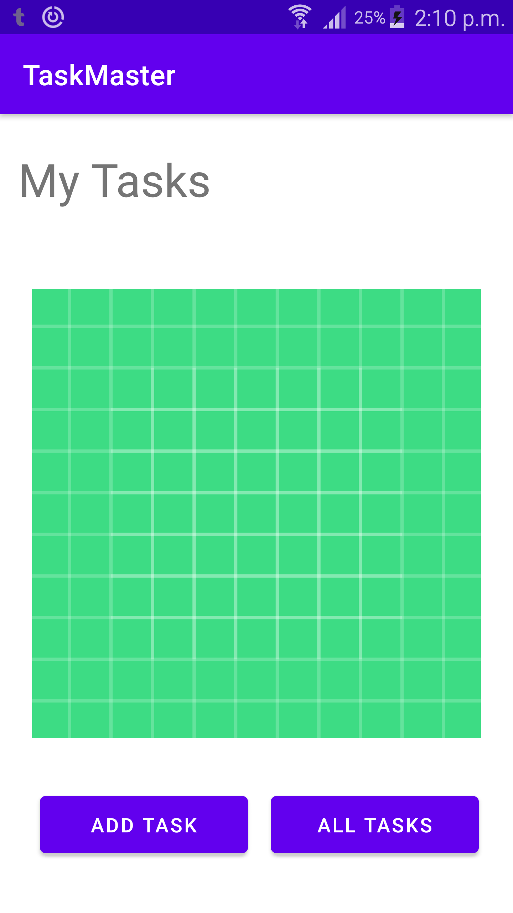
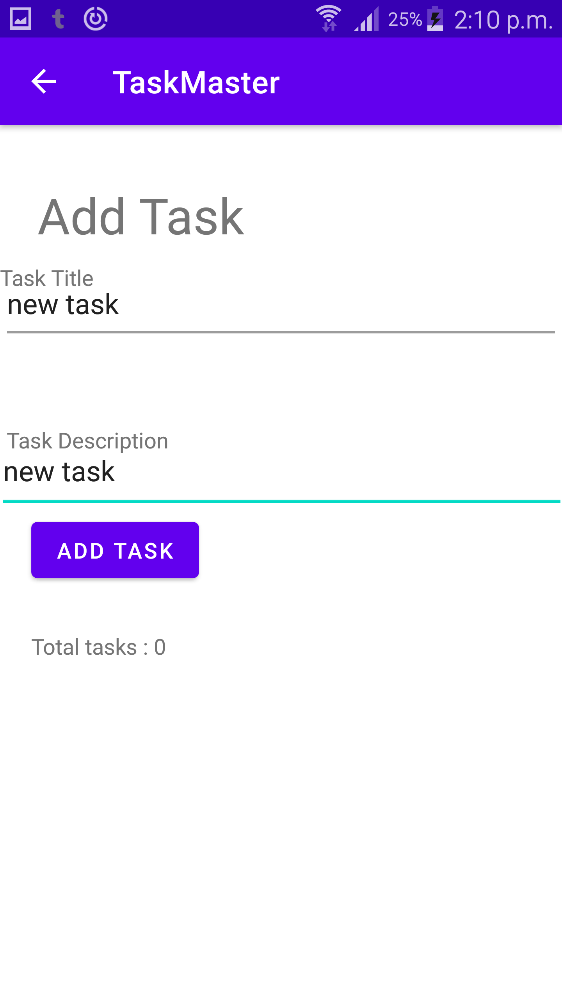
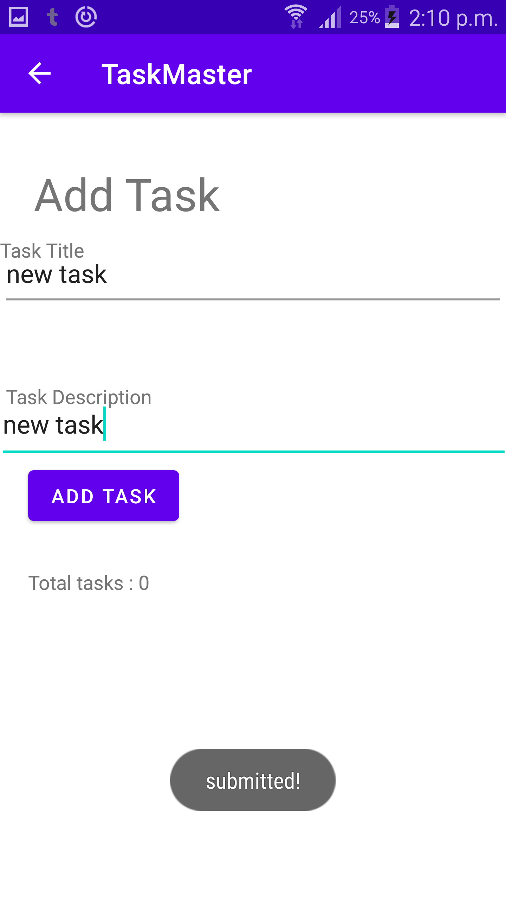
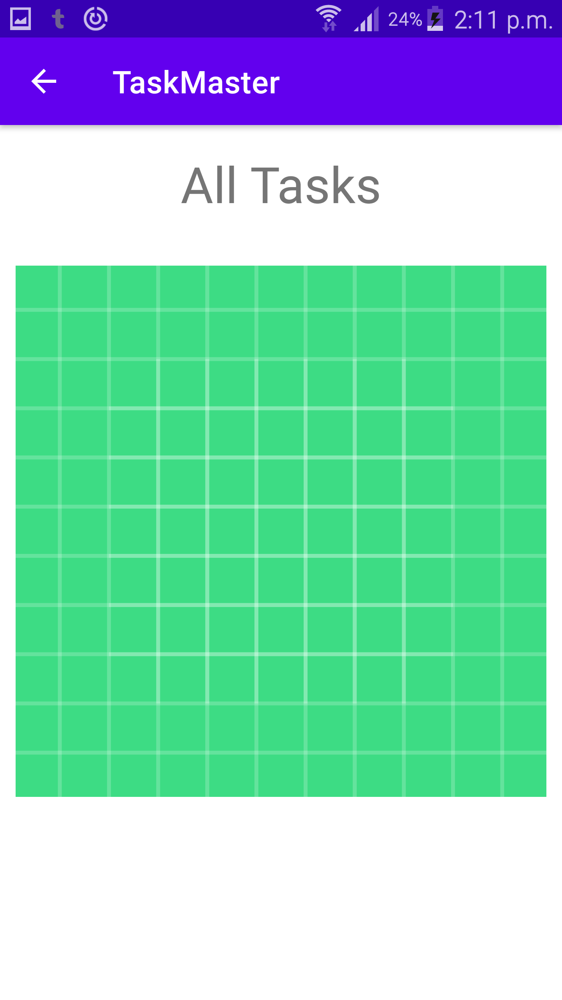
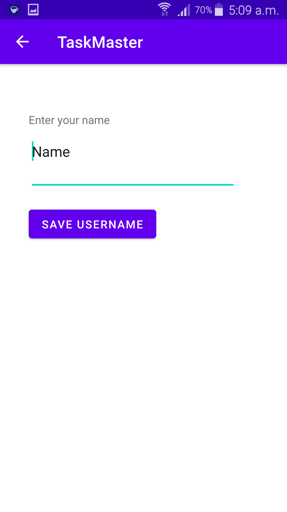
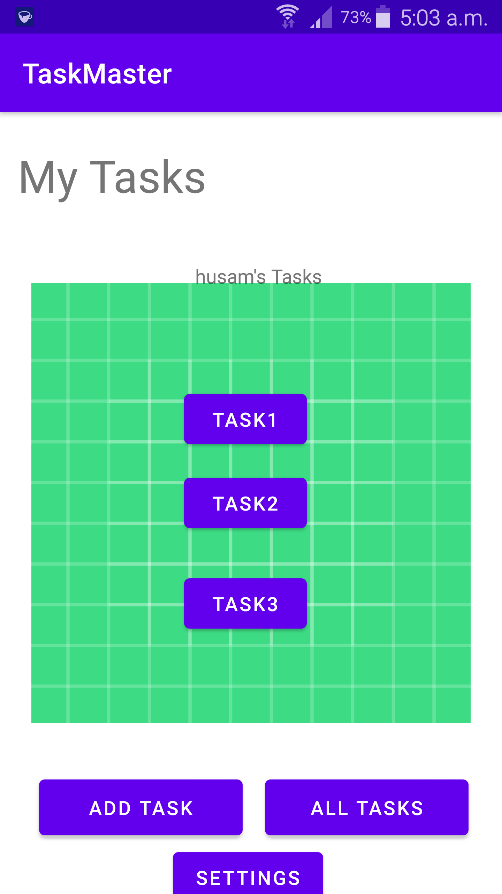
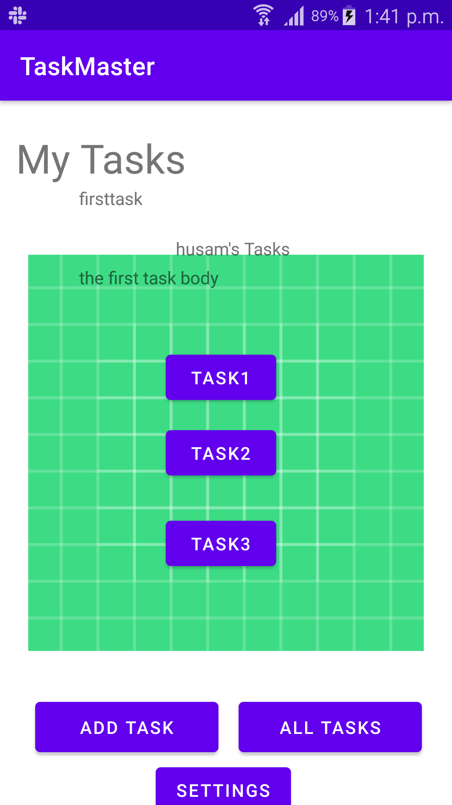

# Taskmaster

## Lab26

## Using andriod studio I created 3 activities the main activity, all tasks activity and add task activity .

## 1. Home page which contains an image and two buttons each button starts a new activity

## 2. Add a task page where the user can add a task title and a description and there is a add task button.

## when the user click it will show a message that the task is submitted

## if you click on the back arrow you will be taken to the homepage

## 3. All Tasks page where in this page there is an image and also here there's a back arrow that takes you to the homepage if you click on it .

## Lab27

## 1. User Setting Page where the user can add his name to be saved and the saved name will be viewed in the home page .

## 2. Home Page now Have Task buttons that takes you to that task detais when clicking on any of the task you will be taken to that task details page .

## 3. Task Details page when the user click on a specific task on Home Page he will be redirected to that task details pagr .

## Lab 28

## adding a recycler view for the app and using it to view tasks data

## 1. show the task in the home page where the user can see all his tasks in the home page and can click on them to see them in taskdetails page

## 2. when clicking on any of the recycler view task it will take you to that task detials page

