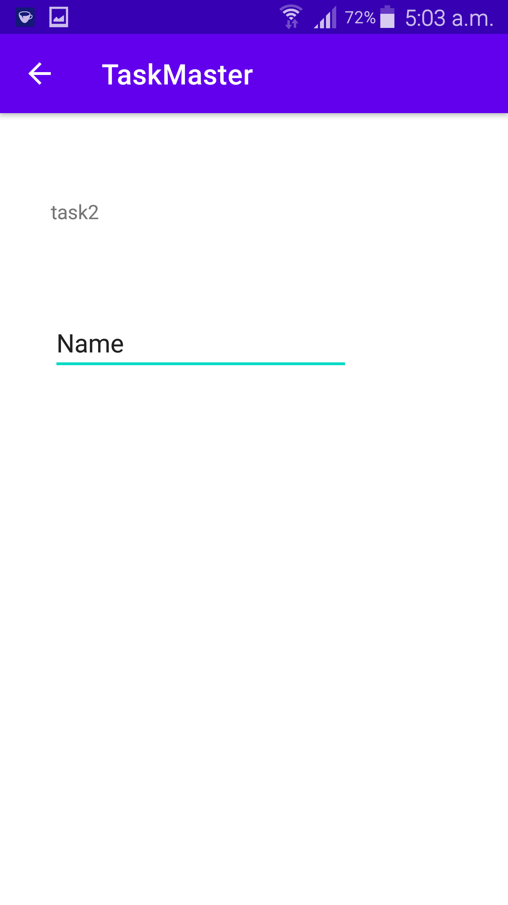
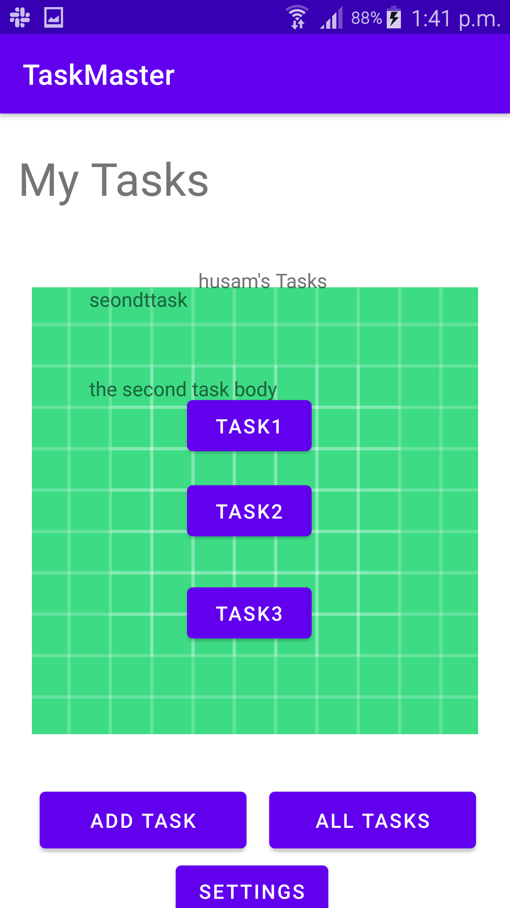
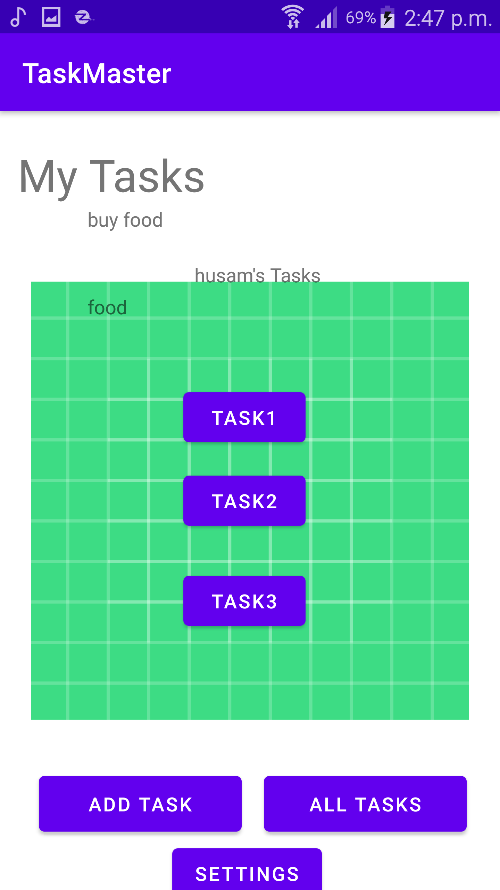
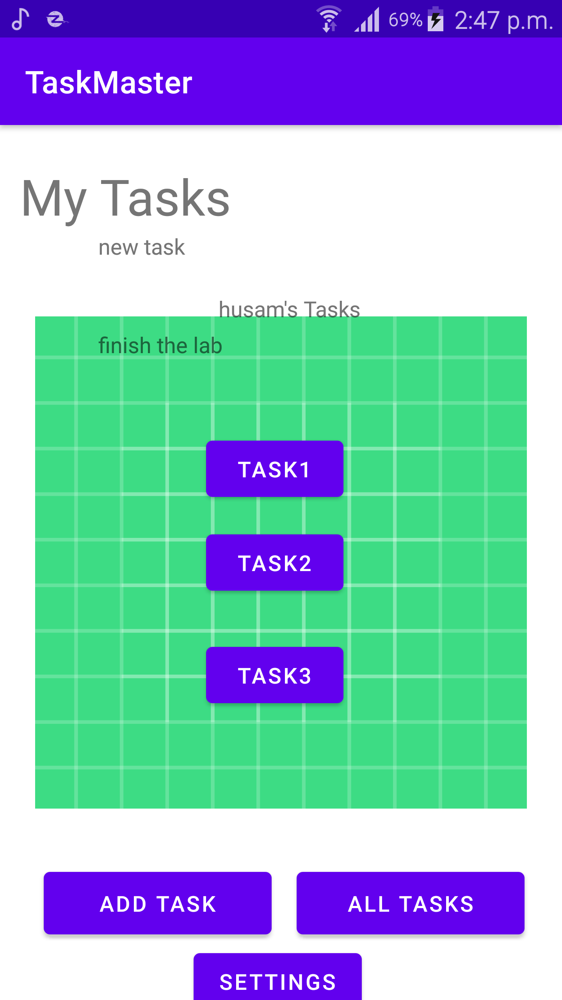
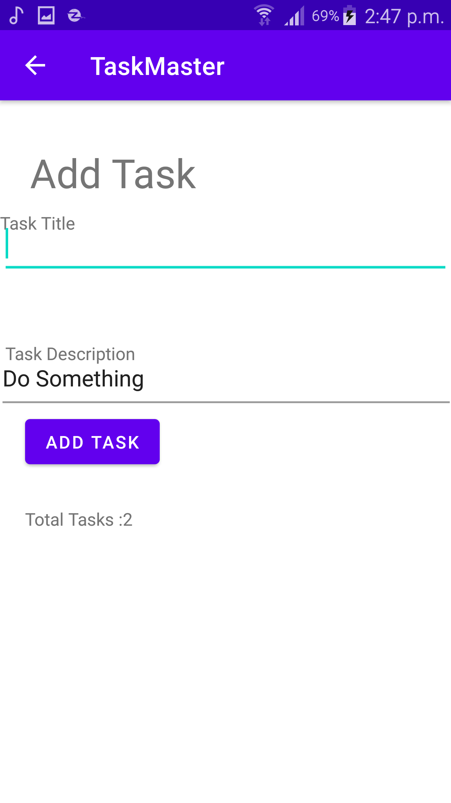
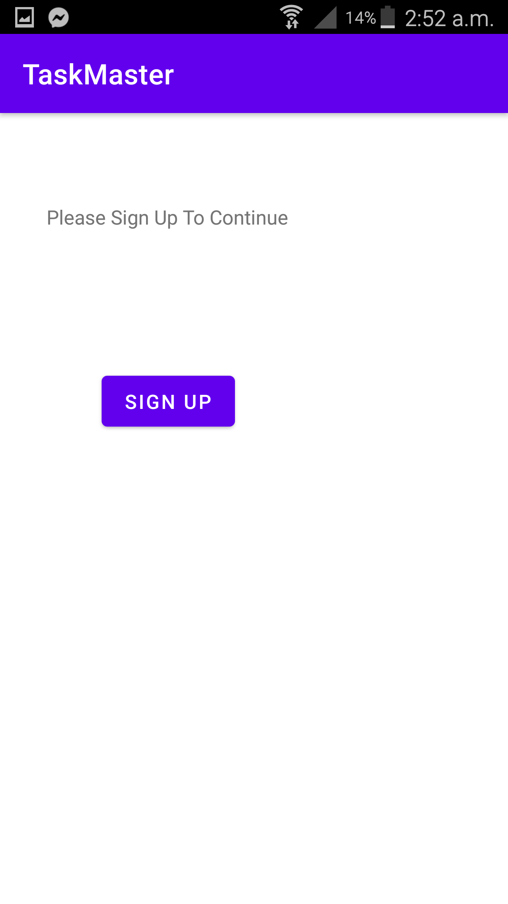
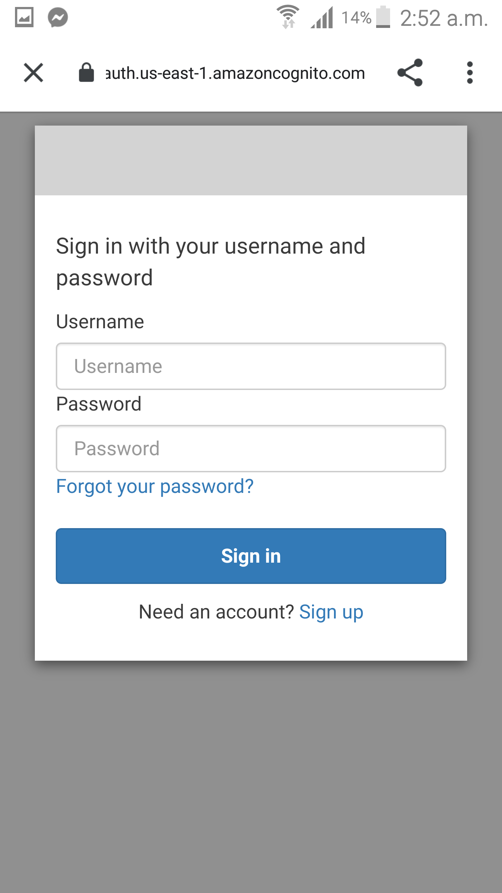

# Taskmaster

## Lab26

## Using andriod studio I created 3 activities the main activity, all tasks activity and add task activity .

## 1. Home page which contains an image and two buttons each button starts a new activity

## 2. Add a task page where the user can add a task title and a description and there is a add task button.

## when the user click it will show a message that the task is submitted

## if you click on the back arrow you will be taken to the homepage

## 3. All Tasks page where in this page there is an image and also here there's a back arrow that takes you to the homepage if you click on it .

## Lab27

## 1. User Setting Page where the user can add his name to be saved and the saved name will be viewed in the home page .

## 2. Home Page now Have Task buttons that takes you to that task detais when clicking on any of the task you will be taken to that task details page .

## 3. Task Details page when the user click on a specific task on Home Page he will be redirected to that task details pagr .

## Lab 28

## adding a recycler view for the app and using it to view tasks data

## 1. show the task in the home page where the user can see all his tasks in the home page and can click on them to see them in taskdetails page

## 2. when clicking on any of the recycler view task it will take you to that task detials page

## Lab 29

## adding a Room database to save data and get data from it in order to save tasks and let the recycler view take the data from the room data base .

## 1. when you use add task page the task will be saved in the room database and you will see it in the home page the recycler view will get data from the room database

  

## 2. you can add task and save them in the room database and you can see how many taks are saved in the database in total tasks view

## 3. when click on any task at the home page you will be taken to that task details page

## Cognito

## Adding Amplify Cognito for authintacation

## 1. SignUp page where you can sign up for a new account in order to use the app

## 2. when you press sign up button you will be redirect to the sign up form where you can add your info

## a confirmation code will be send to you in order to verify the account

## 3. after sign Up the user will be able to sign in his account

## 4. the user can sign out of his account by clicking sign out button also the authenticated user name will be visiable in the main page

